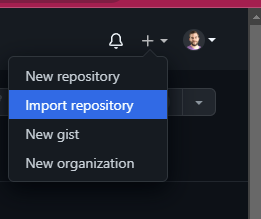
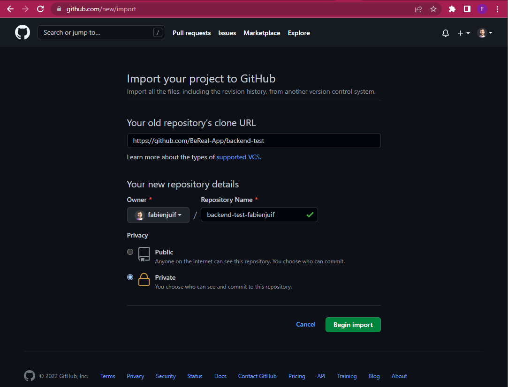
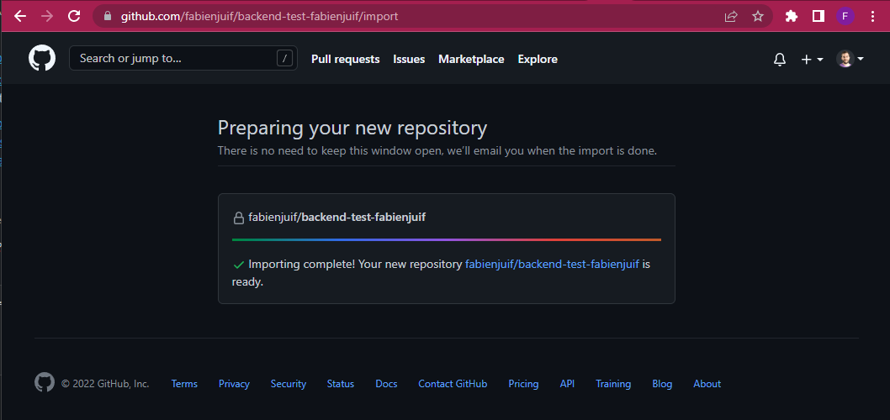
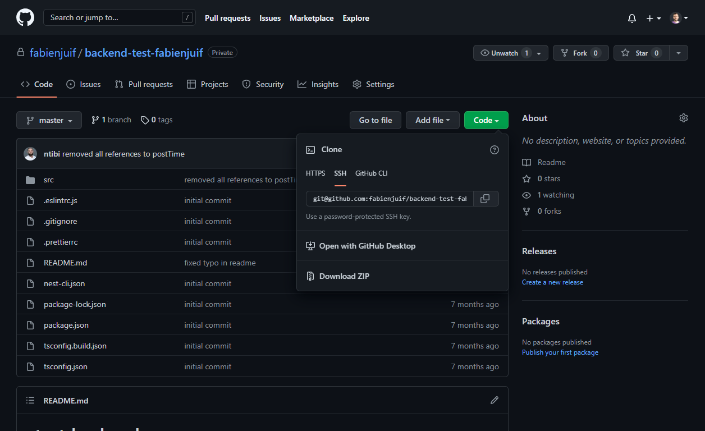
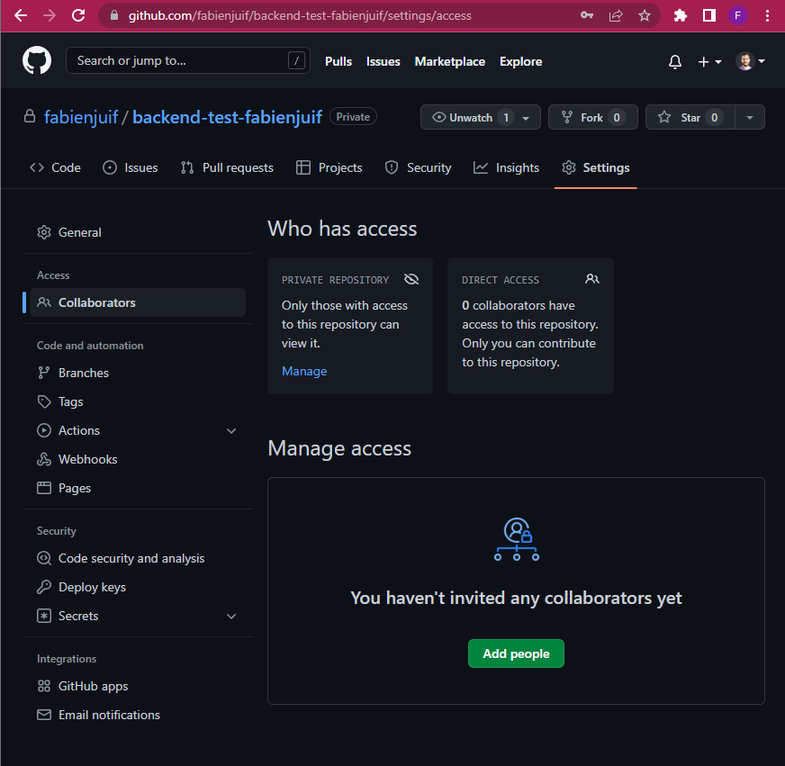

# BeReal - Share your code

You want to share your code to us so we can review it.

Please do **NOT** make it public and follow these steps:

## 1 - Fork the code in a private repository

You have to fork the current repository in your own github account as a **private** repository.

You can achieve this by using the `import` feature of github and use these values:

- **url**:`https://github.com/BeReal-Candidates/backend-go-test.git`
- **repository name**: backend-go-test-<your_github_nickname>
- **private**: true

## 2 - Clone your new repository

You can clone this new repository and push into it.

## 3 - Code ✍️

You can code, commit and push into this new repository.

## 4 - Add collaborators to your new repository [**WHEN YOU ARE READY**]

**WHEN YOU ARE READY** and want us to review your code, you have to add us as collaborators to your repository:

- fabienjuif
- luzam
- gautier-gdx
- dav-m85

From this stage, we considerer you have finished the task!

## 5 - Chill & Wait

Then it us to reach you after we review your code.
Just chill!
